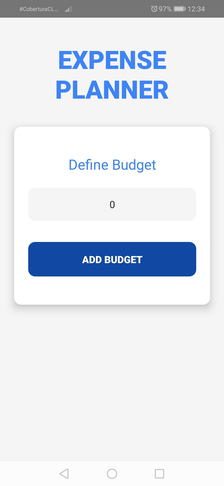
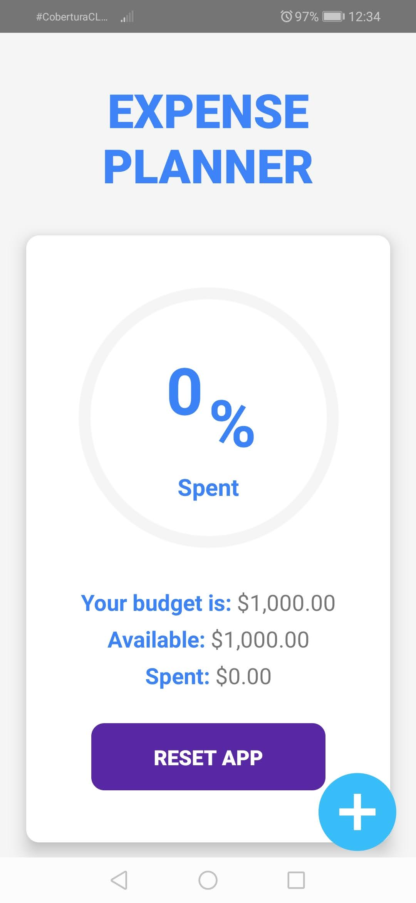
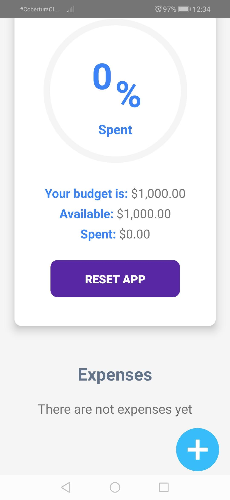
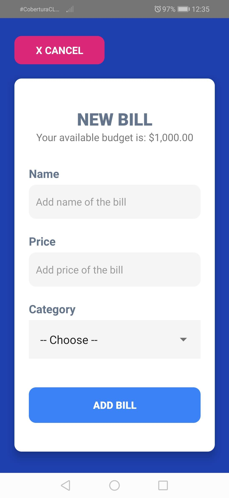
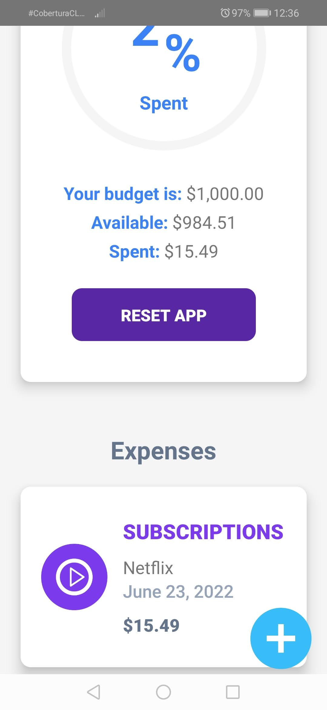
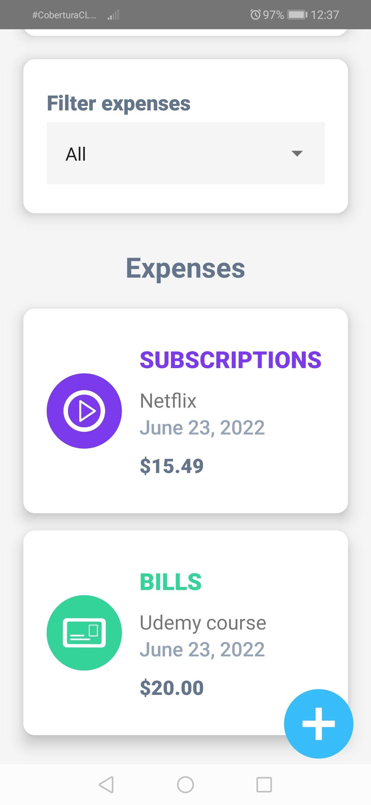
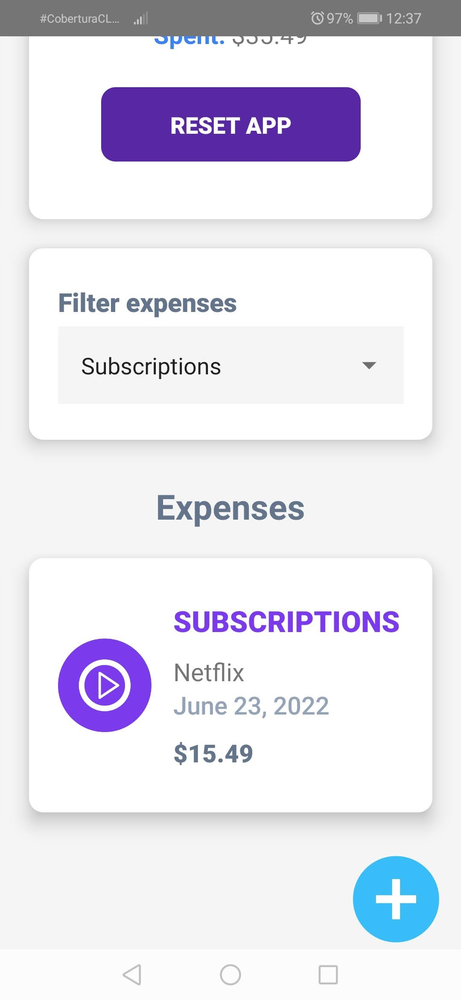
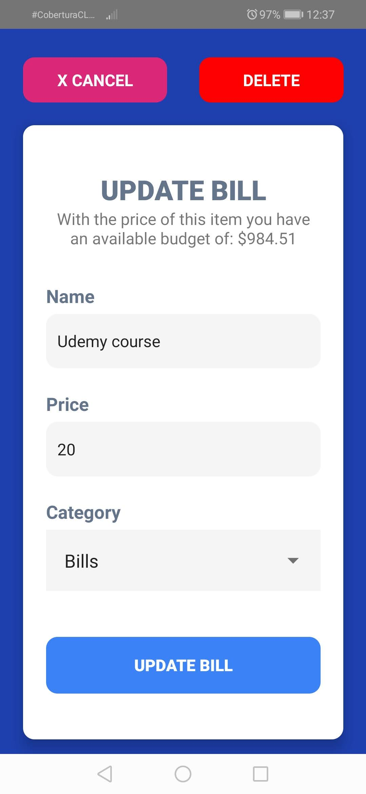
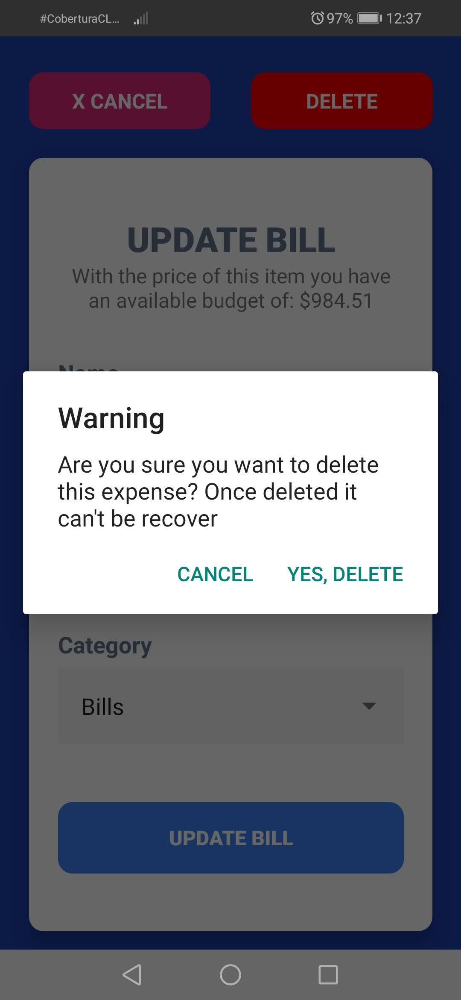
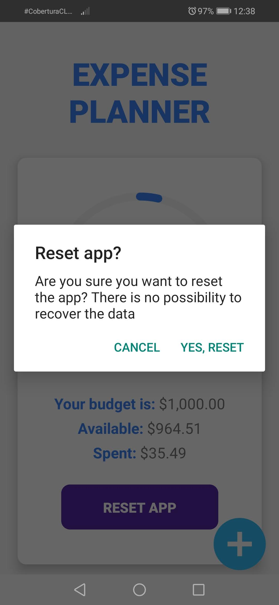

# Budget-RN
This application was created with React Native technology, tested in the Android version.
### Functionality
- Create, edit, filter and delete expenses from a budget provided by the user
- Circular percentage of the amount of money use from the budget
- Reset app in order to change the value of the budget
- Async Storage to keep the data even when the app is closed

## Installation
To install this project follow the next steps:
1.  Download the repository found here: [GitHub Repository](https://github.com/SuaferoanTJK/Budget-RN)
2.  Run **npm install** script
3.  Run **npx react-native run-android** script to raise the development server.
4.  Watch the emergent emulator on your pc or your android cellphone (if the device is connected to the pc via USB and has developer mode enable).

## Screenshots

  
  
  
  
  
  
  
  
  
  

## Get in touch
### LinkedIn
https://www.linkedin.com/in/andrés-f-suárez/
